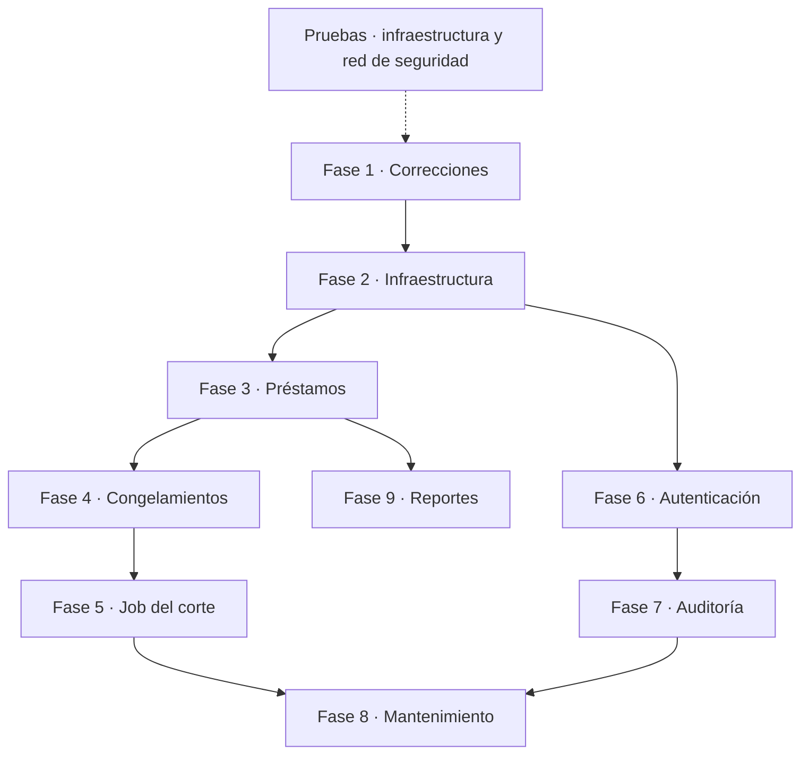

# Plan del proyecto

La lista detallada está en [[Tareas]]. Aquí va el orden de las fases, por qué va en ese orden y qué bloquea cada una.

## Estado al 2026-09-13

- **Hecho:** conexión a PostgreSQL, esquema inicial, CRUD de clientes, caja completa (aportes, retiros y gastos con validación de efectivo, reversión y listado), todas las tareas desbloqueadas de las fases 1 y 2, redondeo (#37), y pruebas de integración montadas (#82–#86) que cubren clientes, caja, fechas, concurrencia y restricciones de la base (#87–#93).
- **Siguiente:** Fase 3 (préstamos): saldo, crear préstamo con desembolso, consultas con pago sugerido, pago con cascada e idempotencia, condonación y reversión, con sus pruebas. El usuario corre #15 y #81 en su base local.

## Fases

Flecha continua = dependencia. Flecha punteada = orden recomendado, no bloqueante.

### Pruebas: infraestructura y red de seguridad (#82–#89)

**Objetivo:** montar el proyecto de pruebas de integración y cubrir lo que ya existe (clientes, caja y reversión de caja) **antes** de modificarlo. Así, cuando la Fase 1 cambie comportamiento (#16, #18–#23), se ve qué cambió a propósito y qué se rompió sin querer.

**Bloqueos:** ninguno. Base de prueba: `prestamos_test` en el PostgreSQL local (D-047). Diseño en [[#Pruebas de integración]].

### Fase 1: Correcciones (#13–#29, #81 · pruebas #90–#92)

**Objetivo:** que lo ya construido cumpla las decisiones y los invariantes. Construir préstamos sobre un índice que protege la columna equivocada, o sobre fechas UTC guardadas en columnas `DATE`, sería arrastrar bugs a la parte más delicada del sistema.

Incluye: índice de cargos, roles en SQL, `DateOnly` y fecha local, ajustes a la reversión de caja, efectivo disponible, y bugs en clientes y entidades.

**Bloqueos:** #29 (P-03).

### Fase 2: Infraestructura (#30–#37 · pruebas #93)

**Objetivo:** todo lo que las fases siguientes dan por hecho.

- Servicio de usuario actual (#30, #31). Hoy devuelve `AdminId`; cuando exista el login, leerá el JWT. Así ese cambio toca un solo lugar, y el orden entre préstamos y autenticación queda libre.
- Tablas, enums y entidades de infraestructura (#32–#34).
- Entidades de préstamo completas y registradas en el contexto (#35, #36).
- Redondeo (#37).

**Bloqueos:** ninguno.

### Fase 3: Préstamos (#38–#48 · pruebas #94–#99)

**Objetivo:** el núcleo del sistema. Crear préstamos con desembolso, cobrar con cascada, condonar y reversar, con idempotencia y bloqueo de fila.

**Orden interno:** proyección de saldo (#38) → crear préstamo (#39) → consultas (#40, #41) → pago (#42) → idempotencia (#43) → condonación (#44) → reversión (#45).

**Bloqueos:** #46 (P-06), #47 (P-07), #48 (P-08). Conviene tener N-02 antes del pago.

La #49 se canceló: la reemplazan #82 (proyecto de pruebas) y #94 (ejemplo canónico).

**Criterio de terminado:** la prueba #94 reproduce el ejemplo canónico de [[Modelo de negocio]] con exactamente esos números, incluido el 84 del mes 3.

### Fase 4: Congelamientos (#50–#52 · pruebas #100)

**Objetivo:** abrir, cerrar y consultar congelamientos. Va antes del job porque el job debe saltar los préstamos congelados.

### Fase 5: Job del corte mensual (#53–#59 · pruebas #101, #102)

**Objetivo:** cargos de interés automáticos, reejecutables y con recuperación de períodos perdidos.

**Bloqueos:** #53, #54, #58, #59 y la prueba #101 esperan N-01 (corte global o por aniversario). El mecanismo genérico (#55–#57) y su prueba (#102) no dependen de eso. El cálculo también depende de #37 (redondeo).

### Fase 6: Autenticación (#60–#68 · pruebas #103–#105)

**Objetivo:** login con JWT y refresh rotativo, eliminar `_adminId` y aplicar roles.

**Bloqueos:** #60, #63–#67 y las pruebas (P-04). Sin el paquete de JWT no hay tokens.

Puede adelantarse a las fases 3–5 si el usuario lo prefiere: gracias a #30 no hay dependencia de código entre ellas.

### Fase 7: Auditoría (#69–#73 · pruebas #106, #107)

**Objetivo:** bitácora automática de cambios y registro de sesiones. Va después de autenticación porque necesita el usuario real y los eventos de login.

**Bloqueos:** #69–#72 y las pruebas (P-02), #73 (P-04).

### Fase 8: Mantenimiento (#74, #75 · pruebas #108)

**Objetivo:** limpieza de tokens vencidos y purga de la bitácora. Reutiliza el mecanismo de `job_runs` de la Fase 5.

### Fase 9: Reportes (#76–#80 · pruebas #109)

**Objetivo:** saldo de caja, interés devengado, cobrado y pendiente, capital pendiente y ganancia real.

**Bloqueos:** #77, #78, #80 y la prueba #109 (P-12: cómo excluir los asientos reversados en reportes filtrados por tipo).

## Pruebas de integración

### Por qué contra PostgreSQL real

Lo más delicado del sistema depende de comportamiento de PostgreSQL que una base simulada (EF InMemory, SQLite) no reproduce:

- Índices únicos **parciales**: un cargo de interés por período, un congelamiento abierto por préstamo.
- Captura de `SqlState 23505` para la idempotencia de pagos y la reversión única.
- `SELECT ... FOR UPDATE` en pagos simultáneos.
- `ON CONFLICT DO NOTHING` y advisory locks en el job.
- `NUMERIC(11,2)`, `DATE` ↔ `DateOnly` y `HasQueryFilter`.

Una prueba contra una base simulada pasaría aunque cualquiera de esas cosas estuviera rota.

### Diseño propuesto

| Pieza | Cómo | Dependencias |
|---|---|---|
| Proyecto | `tests/LoanSystemAPI.IntegrationTests`, con xUnit | `xunit`, `xunit.runner.visualstudio`, `Microsoft.NET.Test.Sdk` (D-047) |
| API en memoria | `WebApplicationFactory<Program>`. Requiere `public partial class Program { }` en `Program.cs`, porque usa top-level statements | `Microsoft.AspNetCore.Mvc.Testing` 8.0.x (D-047) |
| Base de datos | `prestamos_test` en el PostgreSQL local, recreada desde `db/schema.sql` al empezar cada corrida: así también se prueba el script. Las pruebas se niegan a correr si el nombre de la base no termina en `_test` | Ninguna |
| Aislamiento | `TRUNCATE ... CASCADE` antes de cada prueba y recrear el admin semilla. Las clases comparten una colección de xUnit para no correr en paralelo sobre la misma base | Ninguna |
| Reloj | `TimeProvider`, incluido en .NET 8, inyectado en la app; en las pruebas, una subclase falsa escrita a mano | Ninguna |
| Usuario | `AdminId` de prueba por configuración. Con login, un helper que obtiene el JWT (#103) | Ninguna |

### Reglas

- **#17 (fecha "hoy" dominicana) se construye sobre `TimeProvider`**, no sobre `DateTime.Now`. Si no, las pruebas de fechas y del job no pueden fijar qué día es hoy.
- **Una fase no está terminada hasta que pasen sus pruebas de integración.**
- Las pruebas corren en local. El repo no tiene pipeline de CI.

## Riesgos

| Riesgo | Mitigación |
|---|---|
| Interés duplicado al re-correr el job | Índice único correcto (#13) + `ON CONFLICT DO NOTHING`, verificados en #93 y #101 |
| Dos pagos simultáneos pisan el saldo | `SELECT ... FOR UPDATE` sobre el préstamo, verificado en #98 |
| Un pago reenviado por mala conexión se cobra dos veces | `idempotency_key` (#43), verificado en #97 |
| Fechas corridas un día | `DateOnly` + fecha local dominicana (#16, #17), verificado en #91 |
| Reportes inflados por asientos reversados | P-12, verificado en #109 |
| Una corrección de Fase 1 rompe un endpoint existente sin que nadie lo note | Red de seguridad #87–#89 antes de la Fase 1 |
| Pruebas verdes contra una base simulada que no se comporta como PostgreSQL | Pruebas contra PostgreSQL real |
| El vault se desactualiza respecto al código | Regla: el vault se actualiza en el mismo commit que la tarea |
